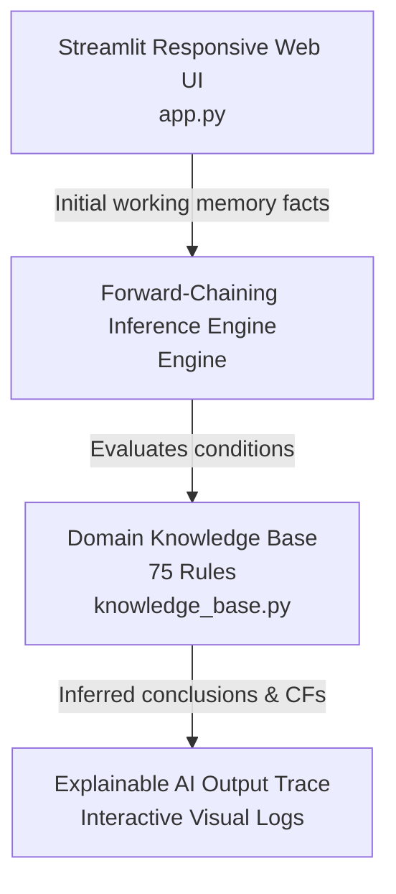

# 📦 SmartReplenish AI — Inventory Optimization Expert System

An interactive, production-grade **Forward-Chaining Inference Engine** with **Certainty Factors (CF)** designed to optimize supply chain procurement, mitigate inventory spoilage, and resolve complex warehouse operational states.


---

## 🎯 Project Overview

Managing modern warehouse inventory requires balancing unpredictable market trends, strict storage limits, and delicate spoilage risks. **SmartReplenish AI** acts as an automated decision-support system. It processes user-defined working memory facts through a structured knowledge base of **75 domain rules**, calculating exact confidence metrics using Certainty Factors ($CF \in [0.70, 0.98]$) to recommend optimal procurement and pricing strategies.

---

## 🏗️ System Architecture & Features

The system follows a modular 4-layer architecture separating the user interface, inference engine, rule base, and audit tools:



### Key Highlights
* **Forward-Chaining Inference Engine:** Iteratively fires valid rules layer-by-layer until no new facts can be inferred (system equilibrium).
* **Uncertainty Management:** Assigns explicit Certainty Factors (CFs) to rules to model real-world supply chain risks accurately.
* **Explainable AI (XAI) Trace:** Provides full transparency by rendering step-by-step logs of triggered rules, matched conditions, and intermediate inferences.
* **Dynamic & Adaptive UI:** Built with Streamlit and custom dark-themed CSS. UI fields (like active spoilage metrics or overhead costs) adaptively appear or hide based on operational conditions (e.g., "Full Warehouse" or "Surplus State").

---

## 🧪 Validated Test Suite

The inference engine has been rigorously evaluated and verified across 5 core operational test scenarios:

| Test Case | Scenario Focus | Primary Inferred State | Strategic Output |
| :--- | :--- | :--- | :--- |
| **1. Supply Chain Crisis** | Logistics paralyzed for critical stock | Paralyzed Supply Chain | Expedite Emergency Freight |
| **2. Perishable Spoilage** | High spoilage risk with tight timeline | Severe Financial Drain | Dynamic Markdown / Liquidate |
| **3. JIT Target** | Storage approaching maximum capacity | Capacity Congestion | Suppress Routine Ordering |
| **4. Tactical Deferral** | Low stock during market downturn | Market Downtrend Risk | Halt Procurement |
| **5. System Equilibrium** | Balanced inventory and steady operations | Normal Operation State | Maintain Current State |

---

## 💻 Local Installation & Setup (From Scratch)

Follow these exact steps to run the project locally on your machine.

1. Prerequisites

Ensure you have **Python 3.10+** installed on your system. You can verify this by running:

```bash
python --version
```

2. Clone the Repository

Clone the project from GitHub and navigate into the project directory:

```bash
git clone https://github.com/hassaanahmad204/Inventory_Expert_System.git
cd Inventory_Expert_System
```

3. Set Up a Virtual Environment (Recommended)

Creating an isolated environment ensures clean package management:

**Windows:**

```cmd
python -m venv venv
.\venv\Scripts\activate
```

**Mac / Linux:**

```bash
python3 -m venv venv
source venv/bin/activate
```

4. Install Dependencies

Install all required libraries specified in requirements.txt:

```bash
pip install -r requirements.txt
```

5. Launch the Application

Run the Streamlit application:

```bash
streamlit run app.py
```

The web dashboard will launch automatically in your browser at http://localhost:8501.

☁️ Live Cloud Deployment
This application is hosted live on Streamlit Cloud:

👉 **[Launch SmartReplenish AI Web App](https://smart-replenish-ai.streamlit.app/)**

(Note: Free-tier deployments may enter sleep mode after inactivity. Clicking the link will awaken the container in ~30 seconds).

📄 License
This project is open-source and available under the MIT License.